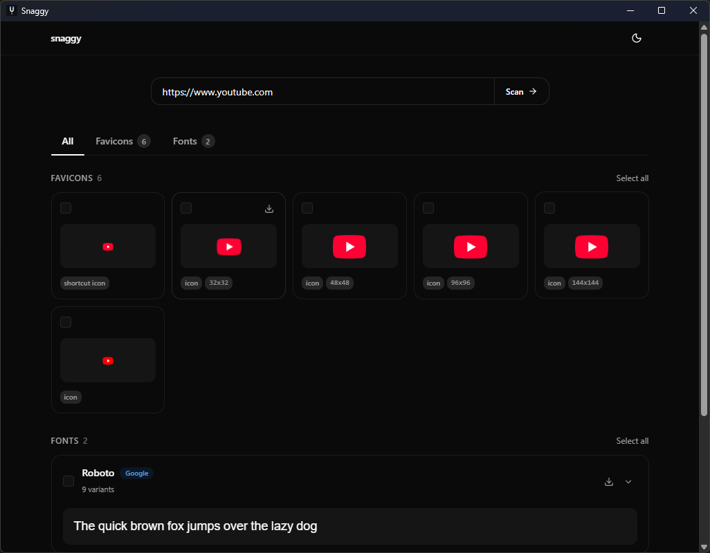

<p align="center">
  
</p>

<h1 align="center">Snaggy</h1>

<p align="center">
  Extract fonts and favicons from any website.<br/>
  Paste a URL, preview what's found, download what you need.
</p>

<p align="center">
  
  
  
  
  
</p>

<p align="center">
  
</p>

---

## Getting Started

### Desktop (Tauri)

```bash
bun install
bun run tauri:dev
```

### Web

```bash
bun install
bun run web:dev
```

This starts the Rust API server and Vite frontend together via `concurrently`.

---

## Build

```bash
# Desktop app
bun run tauri:build

# Web (self-hostable)
bun run build            # frontend -> dist/
bun run server:build     # Rust server binary
```

The server binary serves `dist/` automatically when present, so you only need to deploy the single binary + the `dist/` folder.

---

## Configuration

All optional. Set via environment variables or copy `.env.example` to `.env`.

| Variable                 | Default | Description                           |
| ------------------------ | ------- | ------------------------------------- |
| `SNAGGY_TIMEOUT_GLOBAL`  | `30`    | Overall HTTP client timeout (seconds) |
| `SNAGGY_TIMEOUT_REQUEST` | `10`    | Per-request timeout (seconds)         |
| `SNAGGY_TIMEOUT_PROBE`   | `10`    | Favicon.ico check timeout (seconds)   |
| `SNAGGY_TIMEOUT_IMAGE`   | `10`    | Image proxy timeout (seconds)         |
| `SNAGGY_MAX_STYLESHEETS` | `20`    | Max stylesheets to fetch per scan     |
| `SNAGGY_MAX_IMPORTS`     | `5`     | Max CSS @import rules to follow       |
| `SNAGGY_PORT`            | `3001`  | Server listen port (web mode only)    |

---

## Project Structure

```
snaggy/
  crates/
    snaggy-core/       # Shared scanner & config (no framework deps)
    snaggy-server/     # Axum HTTP server wrapping core
  src-tauri/           # Tauri desktop app (thin wrappers around core)
  src/                 # React frontend (works in both modes)
```

---

## License

[MIT](LICENSE)
